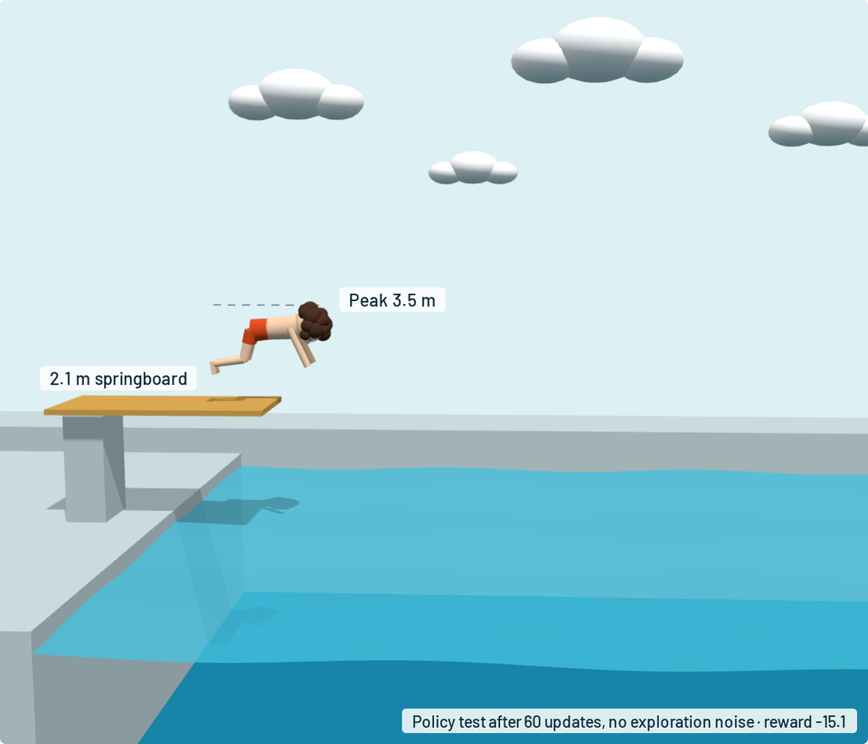
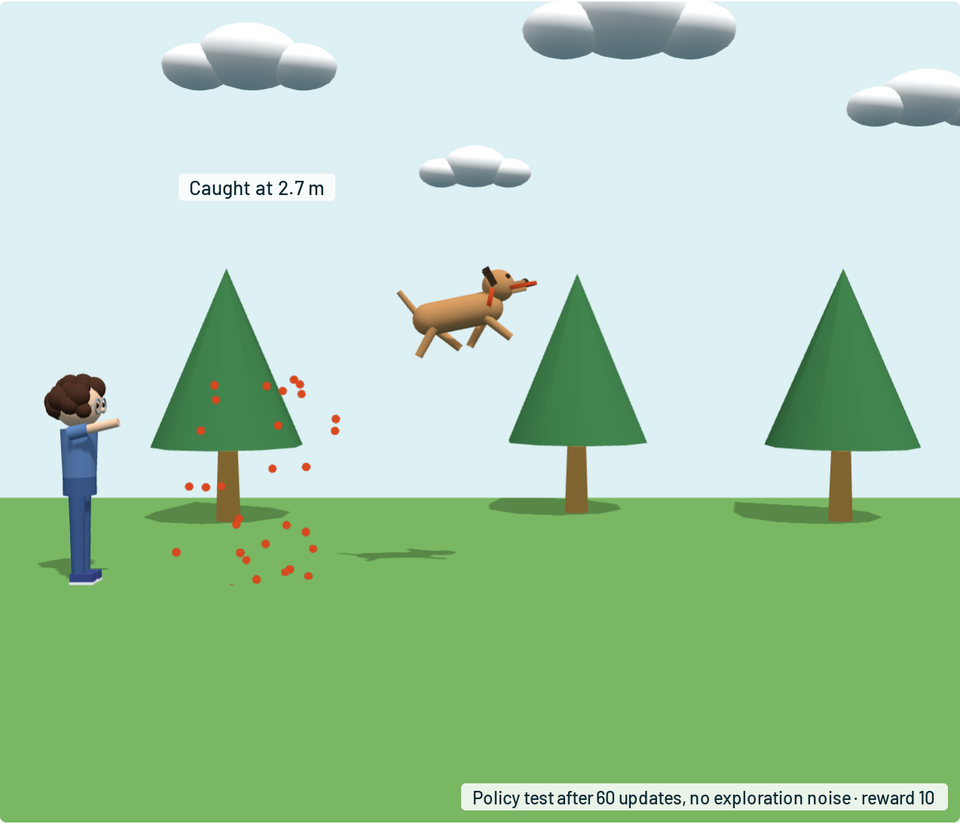
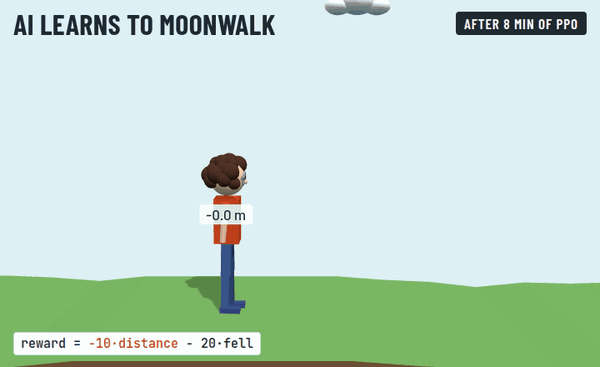

# Splash Lab

A reinforcement-learning playground. Four small physics games, a policy network you design, and a
reward formula you write. Training runs on your machine in PyTorch; the browser draws the episodes.

```
./run.sh --open          # http://127.0.0.1:8765
```

Options: `--port 8765`, `--host 127.0.0.1`, `--threads 4` (CPU threads for PyTorch; small networks are
fastest on a few threads).

## How to play

1. **Pick a game.** Each one is an episode the network plays from start to finish.
2. **Write a reward.** The formula is plain maths over the game's variables, such as `10*caught - miss`.
   The reward arrives once, at the end of each episode. You can change it while training: the network
   keeps what it has learned and adapts to the new goal.
3. **Design the network.** Add, remove and reorder layers, and set each layer's width, activation and LayerNorm.
   The critic (value network) can copy the policy's layout or have its own. *Build this network* starts again from random weights.
4. **Choose an algorithm.** PPO, GRPO, REINFORCE or evolution strategies. Switching keeps the policy weights.
   GRPO (the method behind DeepSeek-R1) plays groups of episodes in the same situation and scores each
   one against its group's average, so it needs no critic.
5. **Set a goal and train.** *Train for N updates* fills the progress bar and estimates the time left, and
   training pauses when it gets there (0 means no limit). The thin bar below it tracks the current update:
   first playing its episodes, then learning from them. Then watch. *Training episodes* shows the latest batch, exploration noise included.
   *Test the policy* runs fresh episodes with the noise turned off.
6. **Tune the scene.** *World* sliders change the physics: board height and gravity for the diver, throw and
   jump strength for the dog, ceiling height and draught for the chef, how slippery the sandwich fillings are.
   You can change them while training, and the network adapts. *Look* only changes the picture: swimsuits,
   fur, a party hat, pizza toppings, the table, the time of day. Looks are remembered in your browser.
7. **Save a checkpoint** to `checkpoints/`. A checkpoint holds the weights, network, settings, world, formula and history.

## The games

<p>
  
  
</p>

| Game | The network sees | The network decides | Changes every episode (defaults; tune them under Scene) |
|---|---|---|---|
| Diver | body pose, spin, height, speed | take-off power, drive and spin, then hips, knees and arms 20× a second | board height 1–3 m |
| Frisbee dog | the dog and the frisbee | running speed 20× a second, then when to jump, how high, how much spin | the throw |
| Pizza chef | the dough's flight, the hands | toss power, spin, wobble and drift, then where to move the hands | ceiling height, draught |
| Sandwich | where the bread and earlier pieces ended up | where to drop each of 5 pieces and how to turn it | bread position, how pieces slide |
| Walker | its pose, joint angles, foot contacts and 10 lidar rays ahead | target angles for both hips and knees, 20× a second, for up to 30 s | rough ground; optional crates, shoves and wind |

The physics is 2D rigid-body simulation with [pymunk](https://www.pymunk.org/) at 120 Hz. The agent decides every 6 physics steps.

### The walker: long episodes, step rewards and live play

<p align="center">
  
  <br><em>The Moonwalk preset (<code>-10*distance - 20*fell</code>) after 8 minutes of PPO: 16.7 m backwards in 12 s.</em>
</p>

The walker is the hard one: hundreds of decisions per episode instead of a handful. Three things make it workable:

- **Step rewards from your formula.** Games marked `dense` report their metrics at every step, and each
  step earns the change in the formula's value. The step rewards add up to exactly the formula on the
  final result, so the formula keeps its meaning, but PPO and REINFORCE get feedback right away.
  GRPO and evolution keep using the episode total.
- **Worker processes.** Heavy games (`parallel = True`) run on up to 10 worker processes. Each one plays whole
  episodes with a NumPy copy of the policy (`nets.export`, `vec.forward`), about 6× faster than one process.
  With *Walk forward*, it walks over 14 m in 12 s after roughly 5 minutes of training on a laptop CPU.
- **Live mode.** *Play live* runs the current network in real time and streams it to the browser.
  Get in its way: shove it with the buttons or the ← → keys, drop crates with the button, the space bar
  or a click on the ground, and blow wind with the slider. Every new run takes a fresh copy of the
  network, so you can keep training and watch it improve. To make it tougher, train it with crates,
  random shoves or wind gusts in the world settings.

## Layout

```
backend/rlplay/
  envs/        the four games (Env: reset, step, metrics, replay)
  formula.py   safe parser for reward formulas (no eval)
  nets.py      MLP built from the layer spec, Gaussian policy, weight snapshots
  trainer.py   rollouts, step rewards, PPO, GRPO, REINFORCE, evolution strategies, checkpoints
  vec.py       running episodes in this process or across worker processes
  server.py    FastAPI: static files and one training session per WebSocket
frontend/
  app.js       UI, WebSocket client, charts, network designer
  stage.js     three.js scenes that replay episodes
  netview.js   network diagram coloured by live weights
```

Adding a game means subclassing `Env` in `backend/rlplay/envs/`, registering it in `envs/__init__.py`
and adding a scene in `frontend/stage.js` that draws its `replay()` data.

Training state lives on the server, in a session tied to your browser tab. Reloading the tab picks up
the same run, still training if it was. A new tab starts its own session. Restarting the server
ends every session, so save a checkpoint to keep a network.

## Showcase video

`video/` turns a real training run into a film. The dive from a 7 m board plays on the left. On the right is
the policy network, with signals flowing through its weights at every decision, plus the learning curve.
At each checkpoint the current dive plays next to ghosts of the very first try and the best try so far.
The soundtrack is synthesised in `sound.py`: every water entry makes a "tishhh" whose loudness and length
follow the real splash, so the flops roar and the trained dives barely hiss.

```
.venv/bin/python video/record.py              # train the diver, save milestones to video/out/showcase.json
pip install playwright numpy imageio-ffmpeg    # once, in any Python environment
python video/render.py                         # video/out/diver-showcase.mp4 (frame by frame, a few minutes)
```

`record.py --formula "-splash" --seed 5 --board 3` records a different reward, run or board height. `render.py --stills 5,30`
saves single frames to check the look. You can also open `video/showcase.html` through any static server
at the repo root to preview it live.
